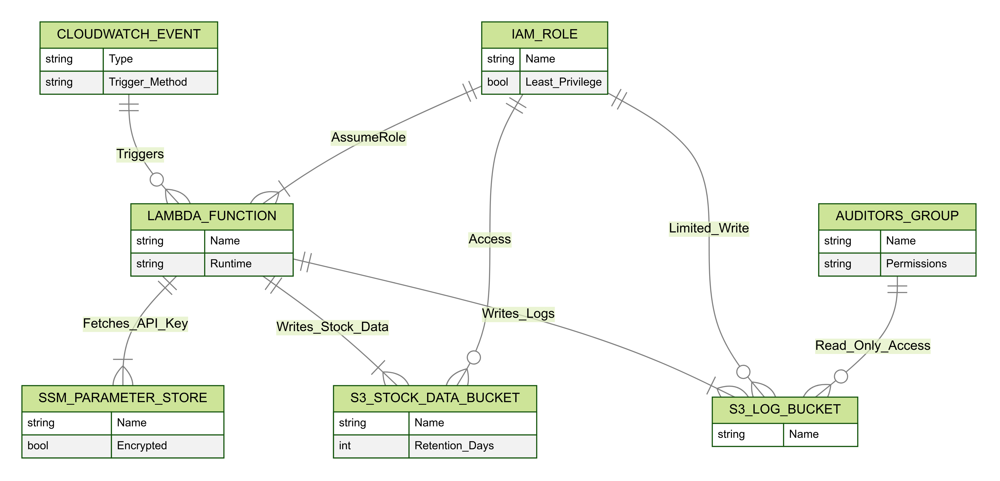

 
Click to expand ASCII text

<pre>
▗▖  ▗▄▄▄▗▄▄▄▗▄▄▖     ▗▄▄▗▄▄▄▗▄▄▄▖     ▗▄▖        ▗▖▗▄▖▗▄▄▖ 
▐▌  ▐▌    █▐▌       ▐▌  ▐▌    █      ▐▌ ▐▌       ▐▐▌ ▐▐▌ ▐▌
▐▌  ▐▛▀▀▘ █ ▝▀▚▖    ▐▌▝▜▐▛▀▀▘ █      ▐▛▀▜▌       ▐▐▌ ▐▐▛▀▚▖
▐▙▄▄▐▙▄▄▖ █▗▄▄▞▘    ▝▚▄▞▐▙▄▄▖ █      ▐▌ ▐▌    ▗▄▄▞▝▚▄▞▐▙▄▞▘
                                                                                                                                                                                               
</pre>

# AWS CloudFormation Stack Overview

This repository contains a CloudFormation template that deploys a serverless solution for regularly fetching and storing stock prices. 

## Resources Created by cf_lambda_mag7.yaml AWS Cloud Formation Template 

1. **StockDataBucket (S3)**  
   - Primary bucket for storing fetched stock data (JSON files).  
   - **Lifecycle Policy** automatically deletes objects after 30 days to manage storage costs and data retention.

2. **LogBucket (S3)**  
   - Secondary bucket for logging information (e.g., operational details from the Lambda function).  
   - Separating logs from main data helps facilitate better monitoring and compliance.

3. **LambdaExecutionRole (IAM Role)**  
   - Grants the Lambda function limited permissions to:
     - **Put/Get** objects in the StockDataBucket and LogBucket.  
     - Retrieve the API key from **AWS Systems Manager Parameter Store**.
   - Enforces least privilege so the Lambda only has access it genuinely needs.

4. **StockLambdaFunction (Lambda)**  
   - Fetches stock prices from an external API using the API key stored in Parameter Store.  
   - Uploads fetched data to `StockDataBucket`, while recording operational logs in `LogBucket`.
   - Encapsulates the business logic for data retrieval and storage.

5. **StockApiKey (SSM Parameter)**  
   - Stores the external API key in an encrypted parameter.  
   - Access is restricted to the Lambda function through its IAM role for enhanced security.

6. **StockDataEventRule (CloudWatch Events Rule)**  
   - Schedules the Lambda invocation every 6 hours (cron expression).  
   - Ensures periodic, automated fetching of fresh stock prices without manual triggers.

7. **PermissionForEventsToInvokeLambda (Lambda Permission)**  
   - Grants CloudWatch Events the rights to invoke the Lambda function.  
   - Binds the scheduling mechanism to the actual Lambda execution.

8. **AuditorsGroup (IAM Group)**  
   - Provides read-only access to the logs bucket for auditing purposes.
   - Policy:
   - Allows s3:ListBucket and s3:GetObject actions on the logs bucket.
9. **Auditor01 and Auditor02 (IAM Users)** 
   - Users assigned to the AuditorsGroup.
   - Permissions: Read-only access to the logs bucket (enables auditing/log review).

## Security Highlights (Mapping to NIST CSF)
- **Protect (PR.PT-1)**:  
  - “Audit/log records are determined, documented, implemented, and reviewed in accordance with policy.”
  - LogBucket collects Lambda logs.
  - Auditors are granted read-only access, enabling regular reviews and segregation of duties.
- **Protect (PR.DS-1)**:  
  - “Data-at-rest is protected.”
  - Distinct data and log buckets;
  - API keys stored securely in AWS SSM Parameter Store.
  - Server-side encryption using S3 managed keys.
- **Protect (PR.AC-3)**:  
  - “Remote access is managed.”
  - Uses least-privilege IAM roles and user groups, restricting nonessential access paths (AuditorsGroup read-only policy).
---

**Author**: *Zach Almog with the kind help of various LLMs*  
**License**: MIT or as appropriate.  
